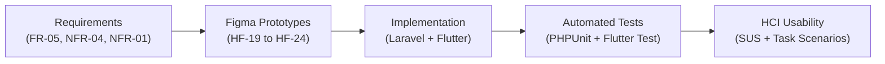

# Velune Carpool Platform - Requirements Traceability Matrix (RTM)

**Course:** IT3060 Human Computer Interaction (Milestone 03)  
**Group:** WE_162  
**Module:** HR / Corporate & System Integration  
**Author:** IT23555112 (Amanda Jayawardena)  
**Target Branch:** `feature/hr-corporate`  

---

## 1. Traceability Overview

The Requirements Traceability Matrix (RTM) validates backward and forward traceability between project requirements specified in Milestone 01/02, Figma high-fidelity prototypes, implementation source code (backend and mobile), and test cases executed in Milestone 03.

---

## 2. Requirements Traceability Matrix Table

| Req ID | Requirement Description | Figma Prototype Screen | Backend Implementation (Laravel) | Frontend Implementation (Flutter) | Automated Test Case IDs | Manual / HCI Test IDs | Verification Status |
| :--- | :--- | :--- | :--- | :--- | :--- | :--- | :--- |
| **FR-05** | Monthly CO2 reduction reports and verified parking allocation for corporate carpool cohorts. | **HF-19** (HR Dashboard) **HF-20** (CO2 Report) **HF-21** (Parking Allocation) **HF-23** (Monthly Reports) | `HrController.php` `routes/api.php` (`/api/hr/*`) `Co2Record.php` `ParkingAllocation.php` `MonthlyReport.php` | `dashboard_screen.dart` `co2_report_screen.dart` `parking_screen.dart` `reports_screen.dart` `pdf_report_viewer_screen.dart` `hr_state.dart` | **TC-HR-005** to **TC-HR-030** **TC-HR-039** to **TC-HR-048** (PHPUnit + Widget Tests) | **TS-01** **TS-02** **TS-03** **TS-04** **TS-06** | **PASS / VERIFIED** |
| **NFR-04** | Privacy & Anonymity: HR screens only display aggregated, anonymised data. No commuter names, emails, phone numbers, or individual trip histories visible to HR. | **HF-19** through **HF-24** (All HR Screens) | `EnsureHrRole.php` `HrController.php` (DTO serialization strips PII) `User.php` | `hr_models.dart` `hr_state.dart` `dashboard_screen.dart` `parking_screen.dart` | **TC-HR-001** to **TC-HR-004** (PHPUnit Sanctum + Anonymity Assertions) | **TS-03** (Cohort audit inspection) | **PASS / VERIFIED** |
| **NFR-01** | Low-friction UI: Maximum 2-tap depth for common supervisory tasks; intuitive modals; consistent typography and contrast. | **HF-19** through **HF-24** | Sanctum Token Auth Resourceful REST Responses | `theme.dart` (Inter typography, Velune Navy palette) `widgets.dart` (`VeluneAppBar`, `MetricCard`) `go_router` | **TC-HR-006** **TC-HR-012** **TC-HR-020** **TC-HR-030** | **TS-01** to **TS-08** (Time on Task < 45s; SEQ > 5.5) | **PASS / VERIFIED** |

---

## 3. Screen-by-Screen Detailed Traceability

### 3.1 HR Dashboard (HF-19)
- **Primary Goal:** Executive overview of campus carpooling adoption, carbon avoidance progress, and facilities alert management.
- **Backend Endpoints:**
  - `GET /api/hr/dashboard` (`HrController@dashboard`)
  - `PUT /api/hr/settings/target` (`HrController@updateTarget`)
  - `DELETE /api/hr/notifications/{id}` (`HrController@deleteNotification`)
- **Mobile Widgets:**
  - [dashboard_screen.dart](file:///c:/Users/user/Desktop/velune_carpoolapp/mobile/lib/screens/dashboard_screen.dart)
  - [hr_state.dart](file:///c:/Users/user/Desktop/velune_carpoolapp/mobile/lib/state/hr_state.dart)
- **Covering Tests:** `TC-HR-001` through `TC-HR-012`, `dashboard_widget_test.dart` (`TC-HR-W01` to `TC-HR-W05`).
- **CRUD Operations Verified:**
  - **Read:** Dashboard overview KPIs, campus progress arc, corporate alert feed.
  - **Update:** Campus decarbonization target % edit dialog with persistence.
  - **Delete:** Corporate notification alert dismissal from bottom sheet.

### 3.2 CO2 Reduction Report (HF-20)
- **Primary Goal:** Audit corporate emission offsets, inspect weekly carbon metrics, and verify environmental equivalencies.
- **Backend Endpoints:**
  - `GET /api/hr/co2/summary` (`HrController@co2Summary`)
  - `POST /api/hr/co2/records` (`HrController@addCo2Record`)
- **Mobile Widgets:**
  - [co2_report_screen.dart](file:///c:/Users/user/Desktop/velune_carpoolapp/mobile/lib/screens/co2_report_screen.dart)
- **Covering Tests:** `TC-HR-013` through `TC-HR-020`, `co2_report_widget_test.dart` (`TC-HR-W21` to `TC-HR-W24`).
- **CRUD Operations Verified:**
  - **Create:** Log new weekly carbon record entry with input validation.
  - **Read:** Display cumulative kilograms avoided, tree equivalents, and gasoline gallons saved.

### 3.3 Parking Allocation (HF-21)
- **Primary Goal:** Manage priority charging bays in Deck B, assign verified carpool cohorts, reassign slots, and release bays.
- **Backend Endpoints:**
  - `GET /api/hr/parking/allocations` (`HrController@parkingAllocations`)
  - `POST /api/hr/parking/allocations` (`HrController@allocateSpot`)
  - `PUT /api/hr/parking/allocations/{id}` (`HrController@reassignSpot`)
  - `DELETE /api/hr/parking/allocations/{id}` (`HrController@releaseSpot`)
- **Mobile Widgets:**
  - [parking_screen.dart](file:///c:/Users/user/Desktop/velune_carpoolapp/mobile/lib/screens/parking_screen.dart)
- **Covering Tests:** `TC-HR-021` through `TC-HR-030`, `parking_widget_test.dart` (`TC-HR-W11` to `TC-HR-W15`).
- **CRUD Operations Verified:**
  - **Create:** Allocate new priority bay (`B-28`) to carpool cohort.
  - **Read:** Active allocations list and available bay counter.
  - **Update:** Reassign bay code and update cohort occupancy status.
  - **Delete:** Release allocated bay with confirmation dialog.

### 3.4 Carpool Statistics (HF-22)
- **Primary Goal:** Visualize commute modal share (carpool vs single car vs transit), 6-month adoption growth curve, and pin key travel corridors.
- **Backend Endpoints:**
  - `GET /api/hr/statistics/commute` (`HrController@commuteStats`)
  - `POST /api/hr/statistics/pinned-routes` (`HrController@pinRoute`)
  - `DELETE /api/hr/statistics/pinned-routes/{id}` (`HrController@unpinRoute`)
- **Mobile Widgets:**
  - [statistics_screen.dart](file:///c:/Users/user/Desktop/velune_carpoolapp/mobile/lib/screens/statistics_screen.dart)
- **Covering Tests:** `TC-HR-031` through `TC-HR-038`, `statistics_widget_test.dart` (`TC-HR-W31` to `TC-HR-W34`).
- **CRUD Operations Verified:**
  - **Create:** Pin new commuter corridor route (`Panadura Coastal Express`).
  - **Read:** Donut modal split chart, 6-month growth curve, average pool size.
  - **Delete:** Unpin corridor route from dashboard registry.

### 3.5 Monthly ESG Reports & Native PDF Viewer (HF-23)
- **Primary Goal:** Generate ISO 14064-1 compliant monthly audits, stream official PDF documents, and purge legacy archives.
- **Backend Endpoints:**
  - `GET /api/hr/reports` (`HrController@reports`)
  - `POST /api/hr/reports` (`HrController@generateReport`)
  - `GET /api/hr/reports/{id}/export` (`HrController@exportReport` - binary stream)
  - `DELETE /api/hr/reports/{id}` (`HrController@deleteReport`)
- **Mobile Widgets:**
  - [reports_screen.dart](file:///c:/Users/user/Desktop/velune_carpoolapp/mobile/lib/screens/reports_screen.dart)
  - [pdf_report_viewer_screen.dart](file:///c:/Users/user/Desktop/velune_carpoolapp/mobile/lib/screens/pdf_report_viewer_screen.dart)
- **Covering Tests:** `TC-HR-039` through `TC-HR-048`, `reports_widget_test.dart` (`TC-HR-W41` to `TC-HR-W45`).
- **CRUD Operations Verified:**
  - **Create:** Generate official monthly ESG audit entry.
  - **Read:** Audit history table and in-app native PDF viewer with verified seal.
  - **Update:** Toggle automated facilities email delivery switch.
  - **Delete:** Delete archived report from storage with instant list update.

### 3.6 Corporate Incentives (HF-24)
- **Primary Goal:** Administrate carpool rewards, EV charging subsidies, and budget disbursal programs.
- **Backend Endpoints:**
  - `GET /api/hr/incentives` (`HrController@incentives`)
  - `POST /api/hr/incentives` (`HrController@createIncentive`)
  - `PUT /api/hr/incentives/{id}` (`HrController@updateIncentive`)
  - `DELETE /api/hr/incentives/{id}` (`HrController@deleteIncentive`)
- **Mobile Widgets:**
  - [incentives_screen.dart](file:///c:/Users/user/Desktop/velune_carpoolapp/mobile/lib/screens/incentives_screen.dart)
- **Covering Tests:** `TC-HR-049` through `TC-HR-056`, `incentives_widget_test.dart` (`TC-HR-W51` to `TC-HR-W55`).
- **CRUD Operations Verified:**
  - **Create:** Add new corporate incentive program with budget validation.
  - **Read:** Active programs list and budget utilization progress bar.
  - **Update:** Edit terms/budget; toggle Pause/Resume lifecycle status.
  - **Delete:** Remove decommissioned incentive program.
